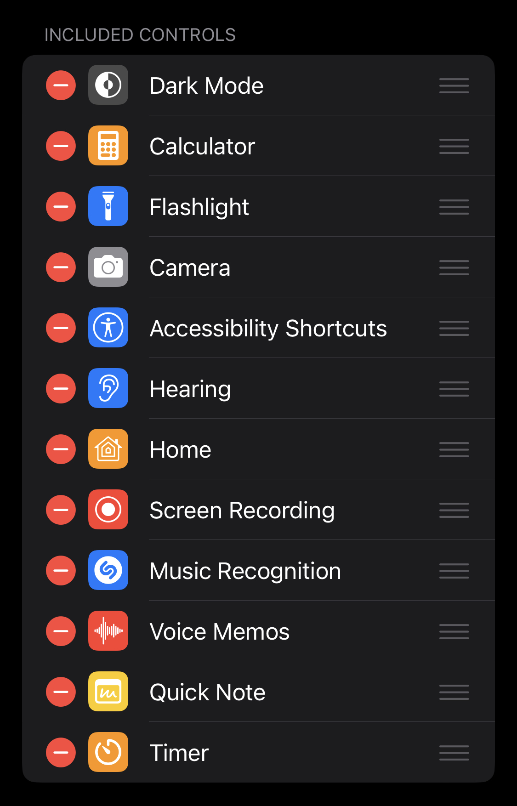
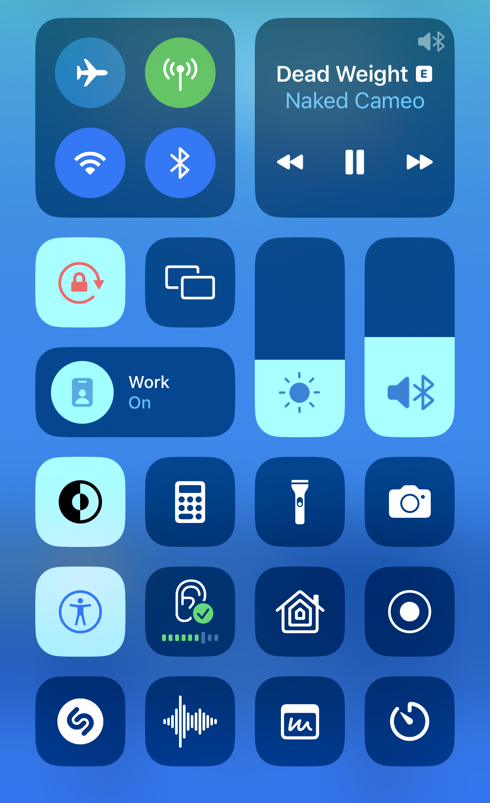

# iOS

My main mobile operating system 

## Apps

I love Apps and download a lot of them (sometimes even make my own). Usually there are at least 200 apps on my phone.

### Must-Have

These Apps **have** to be on my phone for it to be usable to me.

- [[spotify]]
- Comms: WhatsApp, Telegram, Mattermost
- Socials: Twitter, Instagram, YouTube, ~~Reddit~~ (not since [Apollo was killed](https://www.reddit.com/r/apolloapp/s/5s1pPrgg8i))
- Amazon, Kickstarter (gotta keep consuming)
- Finance Stuff (Banking, Crypto)
  - Sparkasse
  - Revolut
  - Coinbase
- Dev
  - Working Copy (for [[git]] on the go)
  - GitHub
  - Scriptable, Data Jar, Shortcutify (dependencies for [[shortcuts]])
  - Obsidian for notes editing 

### Games

My go-to for killing some time is Threes.
I also enjoyed:

- Blackbox
- Candy Crush (I can stop anytime!)
- Smash Hit
- Bloons TD-6
... a more detailed list is in [[gaming]]

### Making Music

- Ultimate Guitar (Chords & Lyrics for songs)
- Audiobus
- Loopy
- GarageBand
- Flip
- AutoTune

## Configuration

### Home Screen 
- The first page of my home screen is mostly made up of siri-suggestion widgets, which display my most (recently) used apps
- Depending on the current focus, the next page will display relevant apps for that mode (work, travel, ...)
- The last page are folders organized by category:
   - Productivity
  - Storage
  - Utilities
  - Devices
  - Music
  - Shortcuts
  - Entertainment
  - Travel
  - Food
  - Finance
  - Shopping
  - Dev
  - Health
  - Smart Home
  - Organization
  - Games

### Focus modes

I have focuses set up for different situations:

- Default (at home, entertainment and gaming)
- Sleep (dark, minimal home screen)
- Work (apps related to my workplace, block distractions)
- Travel (quick access to travel related functions)
- Shopping (activates in certain stores and shows my shopping list/wallet)
- Coding (for [[shortcuts]] development)
- Piano (while making [[music]])
- Driving

Each of these modes has a related lock screen and watch face, which automatically activate when the focus is turned on.

### Control Center

⬆️ This config results in this control center view ⬇️

### Steps to reset the OS

1. Update list of important apps
2. Ensure all important data is stored to the cloud or backed up on separate device(s)
3. Unpair Apple Watch
4. Erase data and content
5. Wait for device to reset
6. Log in

## Devices
iOS devices I've owned and their storage capacity:
- [iPod Touch 4th Generation](mactracker://9894184F-B501-4FBC-9662-7BF7C81165B5) - 32GB
- [iPhone 5](mactracker://C1EF3540-8122-4549-8A28-CCD9CAEF77C2) - 32GB
- [iPad Air](mactracker://19926A5E-013C-45C4-AA3E-FC6CB18F37D5) - 16GB
- [iPhone 6s](mactracker://0F3A4840-6FFE-4A69-B55D-A5CD397FA647) - 64GB
- [iPhone 13 mini](mactracker://EEA8E01A-0CFC-4F20-B6CF-58A8E5EE728C) - 128GB

## See also
- [[macos]]
- [[shortcuts]]

---

This file was created in [[obsidian]] on my iPhone
