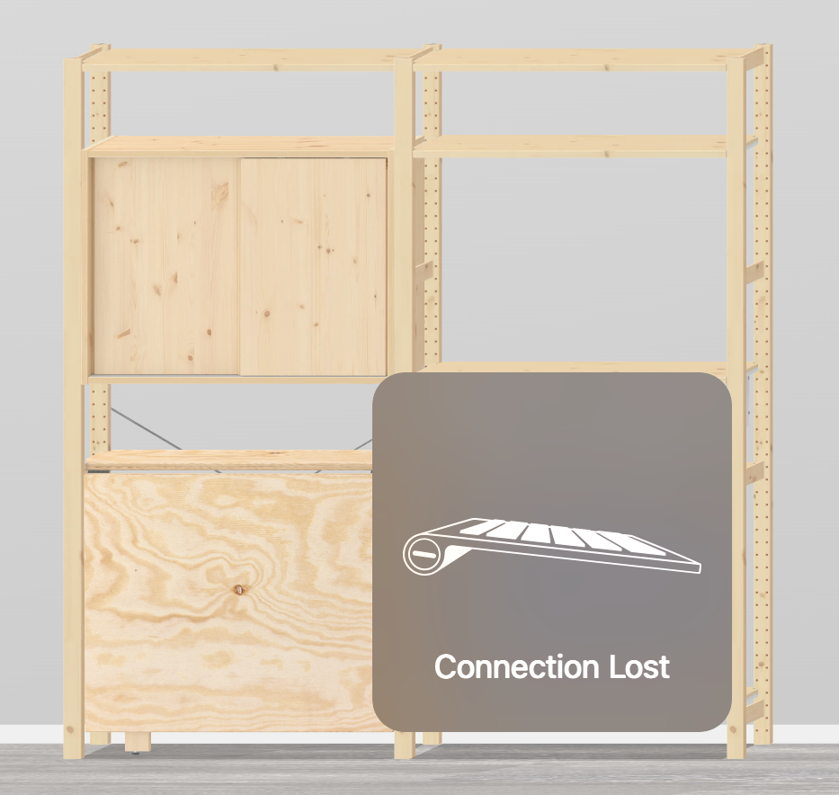

# Workshop
Since I currently can't afford more than one room, my workshop is built into my bedroom.

It consists of an Ivar-setup from IKEA. Sort of like this:

My table [folds down](https://www.youtube.com/watch?v=TTvtQFDbtFk) though, looks like they don't sell that model anymore. On the back of the unit on the right, there is a [Skadis-Pegboard](https://www.ikea.com/de/de/p/skadis-lochplatte-weiss-10321618/), which holds various loose parts in the different compatible containers and hooks. (I also [printed](./3DPrinting) some hooks and polypanel-adapters)

## Links
- https://www.ikea.com/de/de/planner/ivar-planner/ (`GJVQYF`)
-
